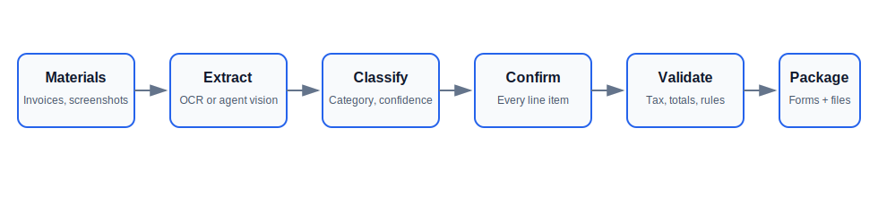
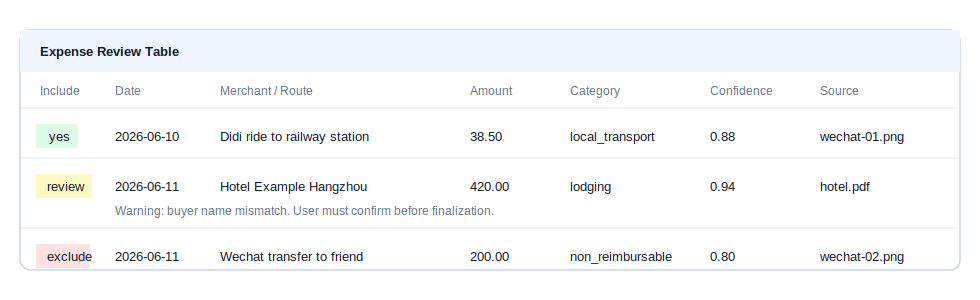
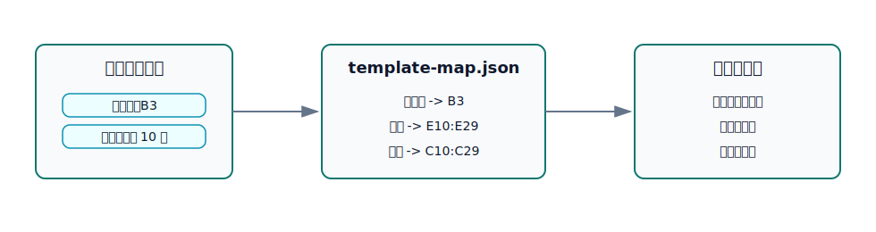

# Reimbursement Agent Toolkit

跨 Agent 可用的报销材料整理工具包。Codex skill 只是其中一个入口，Claude Code、OpenClaw、Hermes 或其他能读文件并运行 Python 脚本的 Agent 也可以使用。

核心目标：用户只需要提供报销材料、公司 Excel 模板和必要配置，Agent 负责识别、归类、逐笔确认、预审、填表和整理附件。



## 能解决什么

- 从一堆发票、微信/支付宝付款截图、打车票、火车票、酒店票、PDF 中整理可报销事项。
- 每一笔识别结果都暴露给用户确认，可以修改类别、日期、金额、备注和是否纳入报销。
- 支持不同公司的报销 Excel 模板，通过 `template-map.json` 做字段映射，不把某一家公司的格式写死。
- 支持不同公司的报销规则，通过 `company-profile.yaml` 和 `travel-policy.yaml` 配置，不硬编码补贴金额。
- 检查企业抬头、税号、重复票据、缺附件、日期异常、付款记录缺发票、金额合计异常。
- 输出报销单、附件目录、分类附件文件夹、问题清单和最终结构化 JSON。

## 安装

### 1. 克隆仓库

```bash
git clone https://github.com/mkshi77/reimbursement-agent-toolkit.git
cd reimbursement-agent-toolkit
```

### 2. 安装 Python 依赖

```bash
pip install openpyxl pyyaml
```

### 3. 安装到 Codex

Windows PowerShell：

```powershell
New-Item -ItemType Directory -Force "$env:USERPROFILE\.codex\skills" | Out-Null
Copy-Item -Recurse ".\skills\reimbursement-assistant" "$env:USERPROFILE\.codex\skills\"
```

macOS / Linux：

```bash
mkdir -p ~/.codex/skills
cp -R skills/reimbursement-assistant ~/.codex/skills/
```

重启 Codex 后，`reimbursement-assistant` skill 会被自动发现。

### 4. Claude Code / OpenClaw / Hermes

这些 Agent 不需要 Codex skill 安装步骤。让 Agent 读取：

- `skills/reimbursement-assistant/AGENT.md`
- Claude Code 可优先读取 `skills/reimbursement-assistant/CLAUDE.md`

核心能力都在 `scripts/`、`schemas/`、`references/` 中，不依赖某一个 Agent 平台。

## 第一次使用前准备

用户至少需要提供：

1. 一份公司报销 Excel 模板，例如 `template.xlsx`。
2. 公司开票信息，例如公司名称、税号、开户行、账号。
3. 公司报销规则，例如补贴标准、是否必须发票、是否需要事前审批。

如果还没有配置文件，可以直接把模板和规则文档交给 Agent，让它先生成草稿：

> 我把公司报销模板和规则文件放在这个文件夹了，先帮我配置报销助手。不要直接填表，先列出你需要我确认的字段映射和报销规则。

配置文件示例在：

- `skills/reimbursement-assistant/assets/examples/company-profile.example.yaml`
- `skills/reimbursement-assistant/assets/examples/travel-policy.example.yaml`
- `skills/reimbursement-assistant/assets/examples/template-map.example.json`

## 日常使用方式

用户不需要记脚本参数，直接用自然语言说明材料位置和模板位置。

推荐说法：

> 我把这次报销材料放在 `materials/` 文件夹里，公司报销模板是 `template.xlsx`。请开始帮我整理，先识别并列出每一笔费用让我确认。

或者：

> 帮我整理这个文件夹里的差旅报销：`D:\报销材料\6月杭州出差`。模板在 `D:\公司模板\差旅报销.xlsx`。如果缺少公司配置，先问我需要确认的信息。

Agent 应该自动执行：

1. 扫描材料文件夹。
2. 识别发票、付款截图、交通票、住宿票、审批材料。
3. 生成逐笔确认表。
4. 让用户确认异常项、低置信度项和是否纳入报销。
5. 按公司规则预审。
6. 按公司 Excel 模板填表。
7. 输出完整报销包。



## Agent 内部命令流

Agent 可按下面命令编排，不要求普通用户手动执行：

```bash
cd skills/reimbursement-assistant

python scripts/scan_materials.py \
  --input MATERIALS_DIR \
  --output work/materials.json

python scripts/extract_receipts.py \
  --materials work/materials.json \
  --output work/extracted.json

python scripts/classify_expenses.py \
  --input work/extracted.json \
  --output work/classified.json

python scripts/validate_claim.py \
  --input work/classified.json \
  --company company-profile.yaml \
  --policy travel-policy.yaml \
  --output work/issues.md

python scripts/fill_template.py \
  --input work/classified.json \
  --template template.xlsx \
  --map template-map.json \
  --output work/reimbursement.xlsx

python scripts/build_package.py \
  --input work/classified.json \
  --materials work/materials.json \
  --out-dir work/package
```

如果图片或 PDF 需要视觉识别，Agent 可以先用自己的视觉能力或 OCR 工具抽取记录，再通过 `extract_receipts.py --agent-records records.json` 接入同一套流程。

## 模板适配

不同公司报销表格式不同，不要改脚本硬编码单元格。应通过 `template-map.json` 映射字段。



模板变更时，只需要更新映射：

- 申请人在哪个单元格
- 部门在哪个单元格
- 费用明细从第几行开始
- 金额、类别、发票号、备注分别在哪一列

## Don't Make Me Think 原则

- Agent 先扫描、识别、归类、列异常，不让用户从空表开始填。
- 每一笔费用都可见，可修改，可排除。
- 明显可报销项默认建议纳入，但仍展示来源和置信度。
- 低置信度、付款记录缺发票、税号不一致、日期不在行程内、疑似私人消费必须提示用户确认。
- 公司规则和表格格式来自用户配置，不写死在 skill 里。

## 仓库结构

```text
skills/reimbursement-assistant/
  SKILL.md                         # Codex skill 入口
  AGENT.md                         # 通用 Agent 入口
  CLAUDE.md                        # Claude Code 入口
  scripts/                         # 可复用脚本
  schemas/                         # 跨 Agent JSON 协议
  references/                      # 工作流、确认规则、分类标准
  assets/examples/                 # 示例公司配置和模板映射
```

